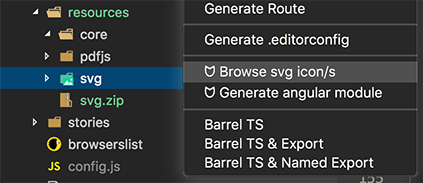
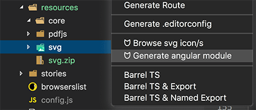
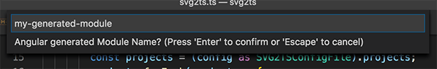
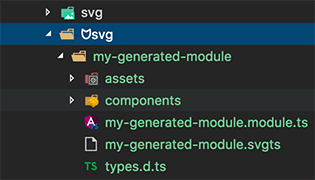
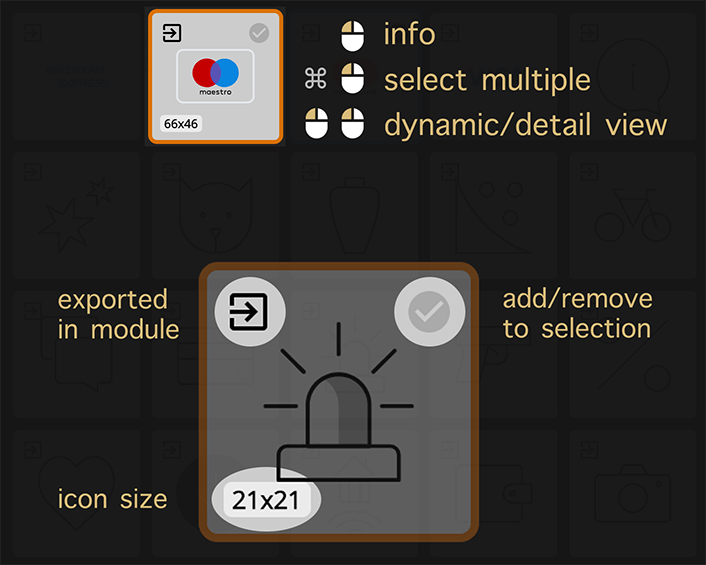
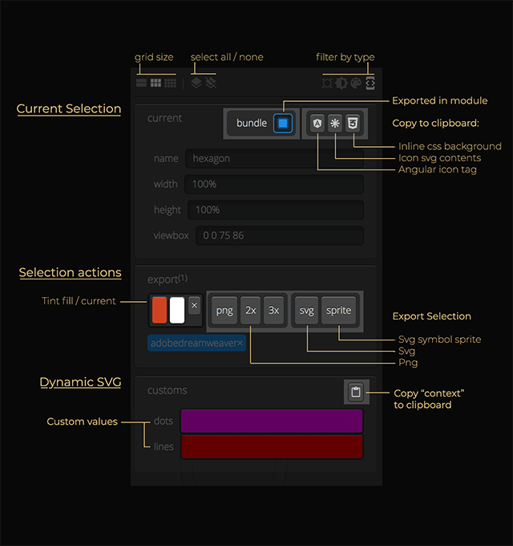

# vscode-svgts

This extension adds svg `browsing` / `module generation` / `exporting` features to VS Code.

It serves as a UI tool for the [svg2ts](https://github.com/xperiments/svg2ts) cli utility.

## Features

### For SVG

- Previews svg files or directories
- Export/s svg to `png` | `svg sprite` | `css`
- Tint fill & current color

### For Angular

- Generates ready to use Angular Components
- Live view "dynamic" svg's parameters
- Export generated "dynamic" contexts

## How to use this extension?

Install and open [Visual Studio Code](https://code.visualstudio.com). Press `Ctrl+Shift+X` or `Cmd+Shift+X` to open the Extensions pane. Find and install the `vscode-svgts` extension. You can also install the extension from the [Marketplace](https://marketplace.visualstudio.com/items?itemName=xperiments.vscode-svgts).

## Opening .svgts files

The main purpouse of this extension is to manage [svg2ts](https://github.com/xperiments/svg2ts) .svgts generated files.

To preview or manage this kind of file click on it, the extension will open.

## Context Menu Actions

### Previewing svg files or directories

Right click in any folder / svg file and choose `Browse svg icon/s`

### Generating Angular Modules from a Folder

Generate a ready to use Angular Module with all the needed components/assets from a folder

Give it a module name (kebab-case)

You will get a ready to go svg2ts angular module

## Viewer

### Viewer Grid

### Viewer Sidebar

